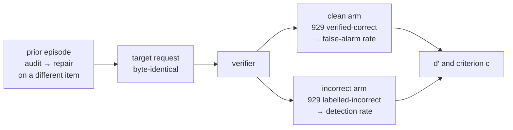
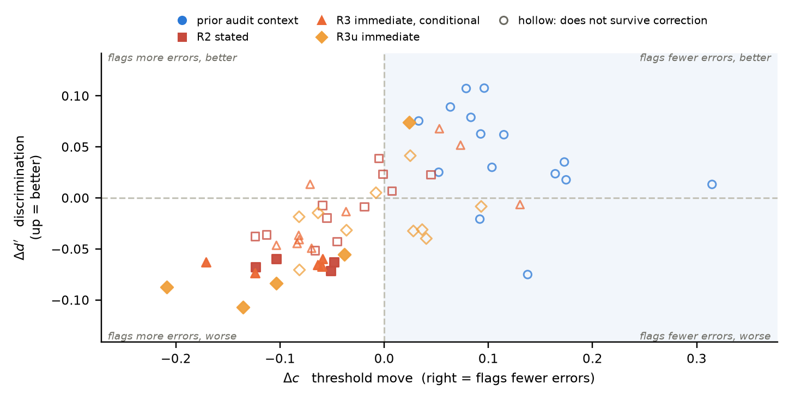

# critxer

[](https://arxiv.org/abs/2608.16003)

**Does a repair a model has already done change the next diagnosis it makes?**

When a language model checks another model's reasoning, its context often already contains an
audit it wrote and a fix it made. This measures whether that changes what it reports next — with
the trace under review held **byte-identical**, so an effect cannot be an artefact of output format.

The dependent variable is the **false-alarm rate**: how often a model reports an error in a
reasoning trace human annotators verified as correct.



Both arms exist because a lower false-alarm rate alone cannot tell a better discriminator from a
model that has just become reluctant to flag anything.

## What we found



One point per model × wording. Right means fewer errors flagged, up means better discrimination.
**Prior audit context (blue) is right of zero in all 15 and hollow in all 15** — more lenient, no
discrimination gain that resolves.

| | R0 false-alarm rate | episode − filler |
|---|---|---|
| Qwen3.6-27B | 0.185 | **−4.00 pp** |
| Qwen3.6-35B-A3B | 0.232 | **−3.59 pp** |
| Ministral-3-14B | 0.691 | **−8.83 pp** |

- **It holds in 15 of 15** model × wording combinations against a length-matched non-audit filler,
  2.8 to 11.5 pp.
- **It is a threshold shift, not an improvement.** The criterion moves in 15 of 15 and survives
  correction in 13; Δd′ survives in **none**, and the Δd′ test is half as sensitive by construction.
- **It survives with reasoning enabled**, where Δc is +0.087 and +0.058 while Δd′ sits on zero.
- **Not polarity drift.** An episode whose audit reported an *error* is more lenient still — the
  opposite sign to what the accumulated-message literature predicts.
- **One wording is not enough.** Five semantically matched wordings changed two claims and the
  reading of a third, and the pre-registered one was unrepresentative every time.
- **The direction is not universal.** Two candidate models failed a pre-specified framing screen,
  and on one the effect is significant and *reversed*.

## Setup

```bash
uv venv .venv --python 3.13
uv sync --extra dev
```

Python 3.13 or newer is required. `uv sync` installs the runtime dependencies from `uv.lock`;
`--extra dev` adds pytest and ruff, so leave it out only if you never intend to run the suite.

## Run

```bash
critxer                      # list every command
critxer analyse-r4 --help    # a command's own options
```

Models are served separately as an OpenAI-compatible endpoint (vLLM 0.26 here); this package speaks
only HTTP, so **every interval can be recomputed from persisted JSON with no GPU**.

```bash
critxer allocate                                           # the disjoint, source-stratified arms
critxer screen --endpoint ... && critxer analyse-screen     # gate 0: is the instrument sensitive?
critxer run-ladder --endpoint ... --family F1               # checkpoints per (model, cond, wording)
critxer run-r4        --endpoint ... --warmup ... --filler ...
critxer run-detection --endpoint ... --thinking --max-tokens 8192
critxer analyse-r4 && critxer analyse-detection             # no GPU, no network
critxer figures && critxer tables
pytest && ruff check critxer tests
```

Serving helper: `critxer/cli/serve.sh {up|qwen27b|injector|down}`.

## Layout

```
critxer/core/       library — prompt assembly, metrics, resampling, multiplicity. Unit-tested.
critxer/cli/run/         generation: talks to a served model, writes raw outputs
critxer/cli/analyse/     reads those generations and writes contrasts. No inference.
critxer/cli/make/        the arm allocation, the figures, the LaTeX tables
critxer/cli/tools/       maintenance on artefacts that already exist
tests/              404 tests, enforcing the prompt invariants the comparison rests on
```

Artefacts live under `$CRITXER_DATA` (default `./data`), uncommitted. Per-item probabilities and
per-sample flags are kept, not aggregates, so every interval resamples items.

## Paper

**[Prior Audit–Repair Context Shifts LLM Verifier Thresholds Toward Leniency](https://arxiv.org/abs/2608.16003)**
· Parsa Mazaheri, Kasra Mazaheri · arXiv:2608.16003

## Citation

```bibtex
@misc{mazaheri2026prior,
  title         = {Prior Audit--Repair Context Shifts LLM Verifier Thresholds Toward Leniency},
  author        = {Mazaheri, Parsa and Mazaheri, Kasra},
  year          = {2026},
  eprint        = {2608.16003},
  archivePrefix = {arXiv},
  primaryClass  = {cs.AI},
  url           = {https://arxiv.org/abs/2608.16003}
}
```
